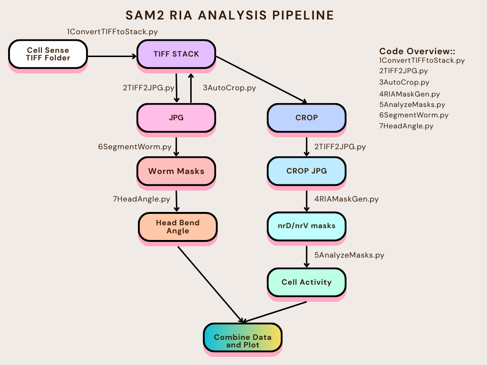

# RIA Segmentation Pipeline



## Overview

This repository contains a comprehensive computer vision pipeline for analyzing neural activity in *C. elegans* worms using **SAM2 (Segment Anything Model 2)** for video segmentation. The pipeline processes calcium imaging data to automatically segment and analyze neuronal regions (nrD and nrV) and head movement patterns.

## Example gif of RIA compartments responding to head angle


## Pipeline Workflow

The analysis pipeline consists of 7 sequential steps, each handled by a numbered Python script:

### 1. **Convert TIFF to Stack** (`1ConvertTIFFtoStack.py`)
- **Purpose**: Converts individual TIFF files into multi-frame TIFF stacks
- **Input**: Directory containing individual TIFF files organized by sample
- **Output**: Multi-frame TIFF stacks (`*_stack.tiff`)
- **Function**: Consolidates temporal sequences into single stack files with numerical sorting for easier processing

### 2. **TIFF to JPG Conversion** (`2TIFF2JPG.py`)
- **Purpose**: Converts TIFF stacks to JPG image sequences with advanced normalization
- **Input**: TIFF stacks from step 1
- **Output**: JPG frame sequences in `2JPG/` directory
- **Features**: 
  - Multiple normalization methods (minmax, percentile, global)
  - Preserves dynamic range while converting to 8-bit
  - Maintains metadata for processing verification
  - Customizable quality settings

### 3. **Automatic Cropping** (`3AutoCrop.py`)
- **Purpose**: Automatically crops videos around the RIA region using SAM2 with quality control
- **Input**: JPG frame sequences from step 2
- **Output**: Cropped frame sequences in `3CROP/` and `4CROP_JPG/` directories
- **Method**: 
  - Interactive bounding box selection on first frame
  - SAM2-based region tracking with confidence thresholds
  - Chunked processing with quality checks
  - Fixed crop window calculation for consistent region extraction

### 4. **RIA Mask Generation** (`4RIAMaskGen.py`)
- **Purpose**: Performs SAM2 video segmentation with interactive prompts for nrD and nrV neurons
- **Input**: Cropped JPG frame sequences from step 3
- **Output**: 
  - Segmentation masks saved as H5 files in `5RIA_SEGMENT/`
  - Optional overlay videos for quality inspection
- **Features**:
  - Interactive point-based prompting (positive/negative clicks)
  - Temporal mask propagation across video frames
  - Advanced quality analysis and re-prompting capabilities
  - Chunked processing for large videos with overlap handling
  - Confidence-based mask validation

### 5. **Mask Analysis** (`5AnalyzeMasks.py`)
- **Purpose**: Extracts brightness and morphometric data from segmented regions
- **Input**: H5 mask files from step 4 and corresponding TIFF stacks
- **Output**: CSV files with quantitative measurements in `6ANALYSIS/`
- **Measurements**:
  - Mean brightness values for each segmented region
  - Background-corrected brightness values
  - Top percentile brightness analysis (top 50%, 25%, 10%)
  - Pixel counts and spatial statistics
  - Left/right side determination with distance transforms

### 6. **Head Segmentation** (`6SegmentWorm.py`)
- **Purpose**: Segments worm head regions using SAM2 for head angle analysis
- **Input**: JPG frame sequences from step 2
- **Output**: Head segmentation masks in `7HEAD_SEGMENT/` directory
- **Method**: Similar to step 4 but focused on head region segmentation
- **Features**:
  - CLAHE contrast enhancement for improved segmentation
  - High confidence thresholds for accurate head tracking
  - Chunked processing with quality validation

### 7. **Head Angle Analysis** (`7headangle.py`)
- **Purpose**: Calculates head angles and bend positions from head segmentation masks
- **Input**: Head segmentation H5 files from step 6
- **Output**: Head angle measurements and analysis in `8HEAD_ANGLE/`
- **Analysis**:
  - Skeleton extraction from head masks using morphological operations
  - Gaussian-weighted curvature calculation
  - Head angle computation with temporal smoothing
  - Bend location detection along head skeleton
  - Statistical analysis of head movement patterns

## Utility Scripts

In addition to the main pipeline, several utility scripts are provided for data inspection, quality control, and visualization:

### **Data Inspection** (`6InspectData.py`)
- **Purpose**: Simple inspection tool for debugging H5 mask files without creating visual plots
- **Input**: H5 files from segmentation steps
- **Output**: Console output with file structure and basic statistics
- **Features**:
  - Loads and inspects H5 file structure
  - Reports attributes, datasets, and data shapes
  - Validates mask data integrity
  - Useful for troubleshooting segmentation issues

### **RIA Mask Checker** (`RIAmask_Check.py`)
- **Purpose**: Interactive visualization tool for reviewing segmentation quality
- **Input**: H5 mask files and corresponding TIFF/JPG frames
- **Output**: Interactive plots and saved visualizations in `7VISUALIZATIONS/`
- **Features**:
  - Interactive slider-based frame navigation
  - Overlay masks on original frames
  - Quality assessment tools
  - Batch processing for multiple videos
  - Export visualization frames

### **Head Angle Visualization** (`visualize_head_angles.py`)
- **Purpose**: Creates publication-ready plots from head angle analysis data
- **Input**: CSV files from head angle analysis (step 7)
- **Output**: PNG visualization files showing temporal patterns
- **Features**:
  - Plots nrD and nrV brightness vs. head angles
  - Normalized data visualization (-1 to 1 scale)
  - Correlation analysis between neural activity and head movement
  - Batch processing for multiple datasets

## Directory Structure

```
RIA_segmentation/
├── 1ConvertTIFFtoStack.py       # Step 1: TIFF stack creation
├── 2TIFF2JPG.py                 # Step 2: Format conversion
├── 3AutoCrop.py                 # Step 3: Automatic cropping
├── 4RIAMaskGen.py               # Step 4: RIA segmentation
├── 5AnalyzeMasks.py             # Step 5: Brightness analysis
├── 6SegmentWorm.py              # Step 6: Head segmentation
├── 7headangle.py                # Step 7: Head angle analysis
├── 6InspectData.py              # Utility: Data inspection
├── RIAmask_Check.py             # Utility: Mask quality checker
├── visualize_head_angles.py     # Utility: Head angle visualization
├── setup.bat                    # Windows setup script
├── setup.sh                     # Linux/Mac setup script
├── requirements.txt             # Python dependencies
├── 1TIFF/                       # Input TIFF files organized by sample
├── 2JPG/                        # Converted JPG sequences
├── 3CROP/                       # Cropped TIFF stacks
├── 4CROP_JPG/                   # Cropped JPG sequences
├── 5RIA_SEGMENT/                # RIA segmentation masks (H5)
├── 6ANALYSIS/                   # Final brightness measurements (CSV)
├── 7HEAD_SEGMENT/               # Head segmentation masks (H5)
├── 7VISUALIZATIONS/             # Quality control visualizations
└── 8HEAD_ANGLE/                 # Head angle measurements (CSV)
```

## Installation and Setup

### Automated Setup

The repository includes automated setup scripts for easy installation:

**Windows:**
```batch
setup.bat
```

**Linux/Mac:**
```bash
chmod +x setup.sh
./setup.sh
```

These scripts will:
- Create a Python virtual environment
- Install PyTorch (with optional CUDA support)
- Install all required dependencies from `requirements.txt`
- Clone and install SAM2 from the official repository
- Download recommended SAM2 model checkpoints

### Manual Setup

If you prefer manual installation:

1. **Create virtual environment:**
   ```bash
   python -m venv ria_segmentation
   source ria_segmentation/bin/activate  # Linux/Mac
   # or
   ria_segmentation\Scripts\activate     # Windows
   ```

2. **Install PyTorch:**
   ```bash
   # For CUDA support:
   pip install torch torchvision --index-url https://download.pytorch.org/whl/cu118
   # For CPU only:
   pip install torch torchvision --index-url https://download.pytorch.org/whl/cpu
   ```

3. **Install dependencies:**
   ```bash
   pip install -r requirements.txt
   ```

4. **Install SAM2:**
   ```bash
   git clone https://github.com/facebookresearch/segment-anything-2.git
   cd segment-anything-2
   pip install -e .
   ```

## Requirements

- **Python 3.8+**
- **SAM2** (Segment Anything Model 2)
- **PyTorch** (CUDA-enabled for GPU acceleration recommended)
- **Core Dependencies** (automatically installed):
  - OpenCV (`opencv-python`)
  - tifffile
  - h5py
  - pandas
  - numpy
  - matplotlib
  - scipy
  - scikit-image
  - tqdm
  - Pillow

## SAM2 Configuration

The pipeline uses different SAM2 models optimized for different tasks:
- **Cropping** (`3AutoCrop.py`): `sam2.1_hiera_tiny.pt` for fast region detection
- **RIA Segmentation** (`4RIAMaskGen.py`): `sam2.1_hiera_base_plus.pt` for balanced accuracy/speed
- **Head Segmentation** (`6SegmentWorm.py`): `sam2.1_hiera_large.pt` for high precision

Checkpoint paths are configured in each script:
```python
sam2_checkpoint = r"c:\path\to\sam2\checkpoints\sam2.1_hiera_base_plus.pt"
model_cfg = r"c:\path\to\sam2\configs\sam2.1\sam2.1_hiera_b+.yaml"
```

**Note:** Update these paths according to your SAM2 installation directory.

## Usage

### Quick Start

1. **Setup Environment**: Run the setup script for your platform
2. **Prepare Data**: Organize your TIFF files in the `1TIFF/` directory by sample (e.g., `1TIFF/MMH223/`, `1TIFF/MMH224/`)
3. **Configure Paths**: Update SAM2 checkpoint paths in scripts 3, 4, and 6
4. **Run Pipeline**: Execute scripts in numerical order (1-7)
5. **Review Results**: Use utility scripts for quality control and visualization

### Interactive Workflow

**Scripts requiring user interaction:**
- **Step 3** (`3AutoCrop.py`): Select bounding box around RIA region on first frame
- **Step 4** (`4RIAMaskGen.py`): Click positive/negative points for nrD and nrV neurons
- **Step 6** (`6SegmentWorm.py`): Click points to define head region boundaries

**Quality Control:**
- Use `6InspectData.py` to verify H5 file integrity
- Use `RIAmask_Check.py` for interactive mask review
- Monitor console output for confidence scores and quality metrics

### Processing Features

- **Chunked Processing**: Large videos are processed in chunks with overlap for memory efficiency
- **Quality Validation**: Automatic confidence scoring and re-prompting for poor-quality masks
- **Progress Tracking**: Detailed progress bars and processing statistics
- **Error Recovery**: Robust handling of processing failures with detailed error reporting

## Key Features

- **Automated Processing**: Minimal user intervention after initial prompting
- **Advanced Quality Control**: 
  - Confidence-based mask validation
  - Interactive re-prompting capabilities
  - Quality metrics and visualization tools
- **Scalability**: 
  - Chunked processing for large video datasets
  - Memory-efficient handling of high-resolution data
  - Batch processing across multiple samples
- **Flexibility**: 
  - Multiple normalization methods (minmax, percentile, global)
  - Configurable quality thresholds
  - Adaptive processing parameters
- **Reproducibility**: 
  - Consistent processing parameters across datasets
  - Detailed logging and metadata preservation
  - Version-controlled analysis pipeline

## Output Data

The pipeline generates comprehensive datasets for quantitative analysis:

### Segmentation Data
- **RIA Masks** (`5RIA_SEGMENT/`): H5 files containing binary masks for nrD and nrV neurons
- **Head Masks** (`7HEAD_SEGMENT/`): H5 files containing head region segmentation masks
- **Quality Visualizations** (`7VISUALIZATIONS/`): Overlay images for quality assessment

### Quantitative Measurements
- **Brightness Analysis** (`6ANALYSIS/`): CSV files with temporal brightness profiles
  - Mean brightness values per region
  - Background-corrected measurements
  - Top percentile analysis (50%, 25%, 10%)
  - Spatial statistics and morphometric data
- **Head Kinematics** (`8HEAD_ANGLE/`): CSV files with movement analysis
  - Head angle measurements over time
  - Curvature analysis with Gaussian weighting
  - Bend position detection
  - Temporal smoothing and filtering

### Metadata and Quality Control
- **Processing Logs**: Detailed logs with timestamps and parameters
- **Confidence Scores**: Per-frame quality metrics for segmentation validation
- **Frame Mappings**: Original to processed frame index correspondence
- **Statistical Summaries**: Aggregate statistics for each processed video

## Citation

If you use this pipeline in your research, please cite the associated publication and acknowledge the use of SAM2 for video segmentation.

## Support

For questions or issues, please refer to the individual script documentation or contact the development team.